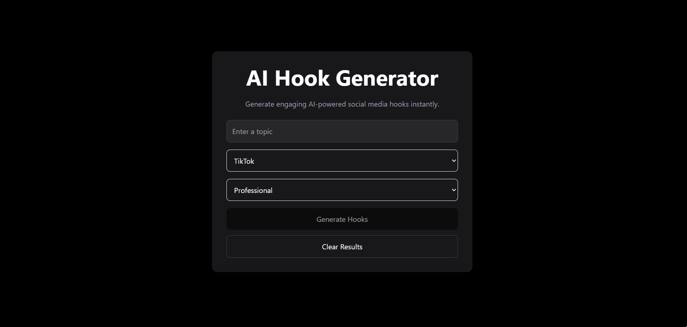
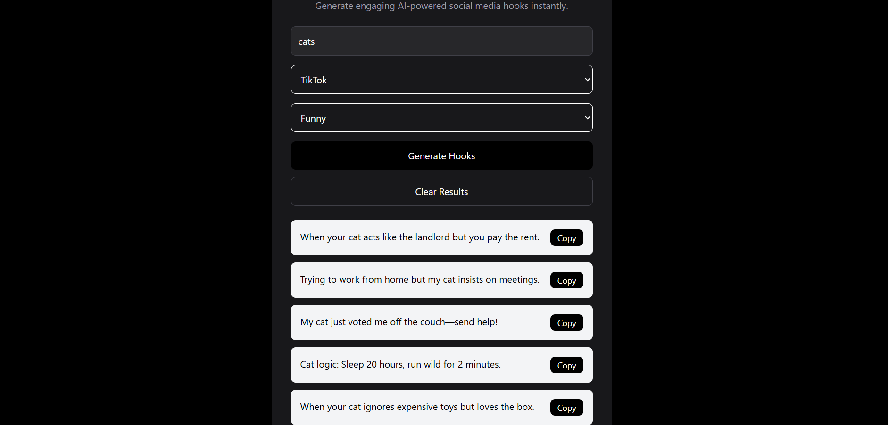

# AI Hook Generator

A full-stack AI-powered web application that generates engaging social media hooks for platforms like TikTok, YouTube, and Instagram
## Live Demo
[Try the App Here](https://ai-hook-generator-eight.vercel.app/)

## Features

hooks produced by AI using the OpenAI API
Different writing styles and platforms
The dark mode user interface
The ability to copy to the clipboard
Error handling and loading states
Modern design that is responsive
React and Express-based full-stack architecture

## Tech Stack

Frontend: 
- React
- Tailwind CSS
- Axios
- Vite

  Backend:
  - Node.js
  - Express.js
  - OpenAI API
  - dotenv
 
    ## Installation:

```bash
git clone https://github.com/Ciaraw-lang/AI-Hook-Generator.git
cd AI-Hook-Generator
```

### 2. Install Frontend Dependencies

```bash
cd client
npm install
npm run dev
```

### 3. Install Backend Dependencies

Open a new terminal:

```bash
cd server
npm install
node server.js
```
### 4. Add Environment Variables

Create a `.env` file inside the `server` folder:

```env
OPENAI_API_KEY=your_api_key_here
```

### 5. Open the App

Visit:

```txt
http://localhost:5173
```

    ## Client

    ``` bash
    cd client
    npm install
    npm run dev

    ## Server
    cd server
    npm install
    node server.js

 Future Improvements:
User verification
saved the history of the hook
The system of favorites
Hooks for exporting
Other AI writing techniques

## Screenshots

### Homepage



### Generated Hooks



Author: 
Ciara Williams
